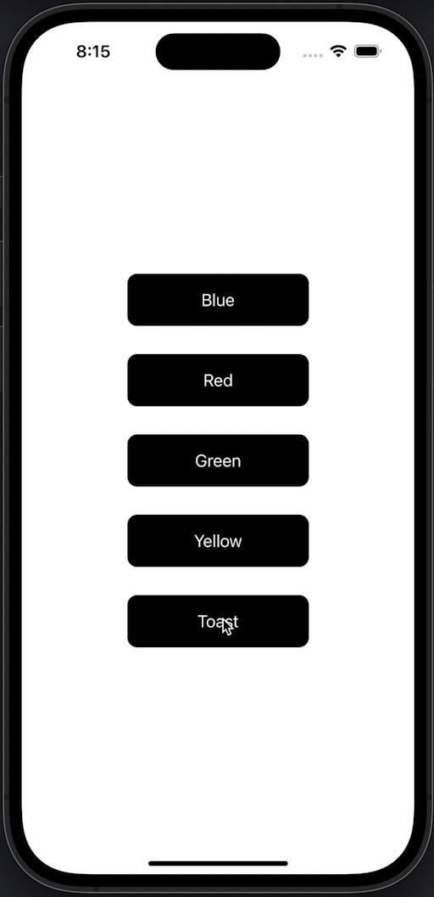

## Layer Manager for SwiftUI

A **very** simple SwiftUI layer manager iOS 15+ that centralizes page presentation and transitions. This serves as a replacement for existing SwiftUI mechanisms for presenting and layering pages (e.g. fullscreenCover). Provides a simple declarative API that supports an arbitrary number of layers and makes it easy to configure page transition styles (animation, entry direction, lifespan, modality, dismissability, etc.). Useful for general page flow as well as toasts that need to outlive the current page or view.

 

 

### Usage

* Copy LayerManager.swift into your project
* Attach an instance of LayerManager to your view hierarchy
* Call methods to push, pop, and toast pages

Check out [ContentView.swift](Example/ContentView.swift) for a working example, but the following pseudocode demonstrates the basic setup:

    struct ContentView: View {
        // 1. Create a LayerManager. You only need one.
        @StateObject var layerManager = LayerManager()

        var body: some View {
            VStack {
                Button("Click Me") {
                    // 2. Use Layer Manager instance to push a new page.
                    layerManager.push(entryStyle:.Animated, entryDirection:.Bottom) { layer in
                        AnyView(/* your view here. */)
                    }
                }
            }
            // 3. Hook up the Layer Manager, which will swallow our
            //    ContentView and add our Layer Manager to the environment.
            .withLayerManager(layerManager:layerManager)
        }
    }

